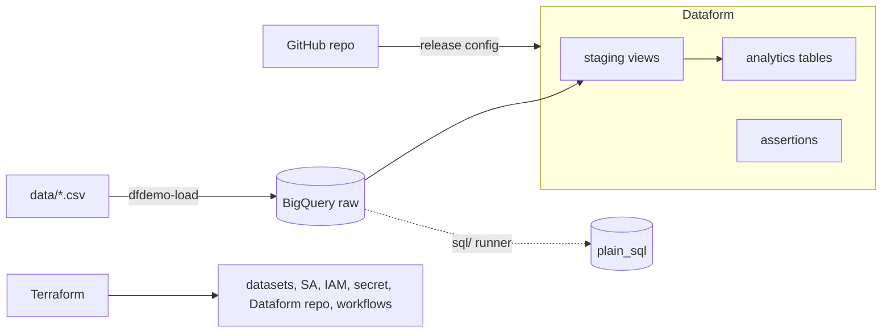

# dataform-demo

Demo repo for the **en_coders** episode on **Dataform**: infrastructure with Terraform, synthetic e-commerce data
loaded into BigQuery, a Dataform project (`.sqlx`), and the same pipeline in plain SQL to show what Dataform adds.

> Status: MVP. Validated offline only (see [ADR 0012](docs/adr/0012-validation-and-known-gaps.md)); it has not run on real GCP yet.
> Decisions live in [`docs/adr/`](docs/adr/README.md), requirements in [`docs/spec.md`](docs/spec.md), the timed script in [`docs/demo-runbook.md`](docs/demo-runbook.md).

## Architecture



## Repo layout

```
.
├── workflow_settings.yaml   # Dataform project (must stay at the repo root)
├── definitions/             # Dataform: sources/, staging/, marts/, events/, assertions/
├── includes/                # Dataform JavaScript helpers and constants
├── sql/                     # Plain-SQL twin of the pipeline (+ README mapping the two)
├── terraform/               # IaC: APIs, datasets, IAM, secret, Dataform repo + workflows
├── src/dataform_demo/       # Python (uv): generate data, load to BigQuery, run sql/, preflight checks
├── data/                    # Committed sample CSVs: batch_1, batch_2, batch_bad
├── docs/                    # spec.md, adr/, demo-runbook.md
├── Makefile                 # `make help`
├── pyproject.toml, uv.lock  # Python dependencies (uv)
└── AGENTS.md                # Working rules for AI agents
```

## Prerequisites

| Tool | Why |
|---|---|
| [gcloud CLI](https://cloud.google.com/sdk/docs/install) | auth, billing check, bootstrap |
| [Terraform](https://developer.hashicorp.com/terraform/install) >= 1.6 (or OpenTofu: `TF=tofu make ...`) | infrastructure |
| [uv](https://docs.astral.sh/uv/) | Python environment |
| git + a GitHub account | Dataform reads this repo from GitHub |
| Node.js (optional) | `make dataform-compile` |
| A GCP project **with billing enabled** | see step 0 |

## Run the whole demo

### 0. Project and billing (one-time)

The project `encoders-sandbox-rodo` must exist and be linked to a billing account (Dataform, Secret Manager and
friends need it; the demo costs cents). Check:

```bash
gcloud billing projects describe encoders-sandbox-rodo      # billingEnabled: true ?
gcloud billing accounts list                                # if not: find your account id...
gcloud billing projects link encoders-sandbox-rodo --billing-account=XXXXXX-XXXXXX-XXXXXX
```

Using another project id? `make set-project NEW_PROJECT=<id>` (see [ADR 0011](docs/adr/0011-hardcoded-project-id-mvp.md)).

### 1. Local setup and credentials

```bash
cp .env.example .env        # optional; edit if you changed the project
make setup                  # uv sync
make auth                   # gcloud login + Application Default Credentials + quota project
make bootstrap              # enables serviceusage + cloudresourcemanager
make preflight              # everything should print [OK]
```

### 2. Push this repo to GitHub (public)

Dataform pulls the code from GitHub, so the repo must be there before the first compile:

```bash
git init -b main && git add . && git commit -m "Initial commit"
gh repo create dataform-demo --public --source=. --push      # or create it in the web UI and `git push`
```

### 3. Create a GitHub token (PAT)

A **PAT (Personal Access Token)** is a revocable password with limited permissions. Dataform uses it to run
`git pull` against your repo; Terraform stores it in Secret Manager.

GitHub -> Settings -> Developer settings -> Personal access tokens -> **Fine-grained tokens** -> Generate:
repository access **Only select repositories -> dataform-demo**, permission **Contents: Read-only**, expiry 7 days.
(If Dataform rejects a fine-grained token, use a classic token with the `public_repo` scope.)

```bash
export TF_VAR_github_token="github_pat_..."     # never commit this
```

### 4. Create the infrastructure

```bash
cp terraform/terraform.tfvars.example terraform/terraform.tfvars   # set github_repo_url
make tf-init
make tf-plan
make tf-apply                # ~2-5 minutes
make preflight-post
```

Creates: 5 BigQuery datasets (`raw`, `staging`, `analytics`, `dataform_assertions`, `plain_sql`), service account
`dataform-runner` with IAM, the secret, the Dataform repository linked to GitHub, release config `production`,
and workflow configs `sales_pipeline` and `events_pipeline`. Commit `terraform/.terraform.lock.hcl` afterwards.

### 5. Load the first batch

```bash
make load-1        # 700 customers, 80 products, 4,037 orders, 7,533 items, 12,292 events
```

### 6. Run the two Dataform processes

In the console: **BigQuery -> Dataform -> `dataform-demo`**. (Labels may differ slightly between console versions.)

1. **Releases & scheduling -> `production`**: the release config compiles `main` hourly; if there is no
   compilation yet, create one manually from that page.
2. Start an execution of the workflow **`sales_pipeline`**, then **`events_pipeline`**.
3. Inspect the dependency graph, the compiled SQL, and the results in `staging`, `analytics` and `dataform_assertions`.

No Dataform run exists until you start it: `workflow_cron_schedule` is empty by default.

### 7. Run the plain-SQL version and compare

```bash
make sql-run       # builds dataset plain_sql, file by file
```

Run `sql/compare_results.sql` in the BigQuery console: both counts must be `0`.

### 8. Incremental load

```bash
make load-2        # August data + status changes for 127 previously pending orders
```

Re-run `sales_pipeline` (fct_orders is incremental: only changed/new orders are MERGEd; expect 6,186 rows) and
`make sql-run` again.

### 9. Break it on purpose

```bash
make load-bad
```

Re-run `sales_pipeline`: assertions fail and `fct_orders` / `mart_daily_sales` are skipped. Then `make sql-run`:
the bad rows land in `plain_sql.fct_orders` before `12_checks.sql` complains.

To repeat the demo from scratch: `make load-1` (truncates raw), then full-refresh Dataform's incremental table and
`DROP TABLE plain_sql.fct_orders`.

### 10. Tear everything down

```bash
make tf-destroy
```

Removes datasets (with their tables), the Dataform repository and workflows, the secret and the service account.
Left behind on purpose: the project and its enabled APIs. Also **revoke the GitHub token**.

## Useful commands

```bash
make help
uv run dfdemo-load --batch 1 --dry-run     # no GCP access needed
make dataform-compile                      # compile the Dataform project locally
```

## Troubleshooting

| Symptom | Likely cause / fix |
|---|---|
| `make preflight`: billing not enabled | Step 0. |
| `terraform apply`: API not enabled / permission denied on `serviceusage` | Run `make bootstrap`; make sure ADC uses the right account (`make auth`). |
| Terraform error creating the Dataform repo about the secret or token | Check `TF_VAR_github_token`, and that `github_repo_url` is the HTTPS `.git` URL. |
| Dataform compile: Git authentication failed | Token expired/wrong scope; try a classic token (`public_repo`). |
| Dataform compile: `dataformCoreVersion` not supported | Set the version the console suggests in `workflow_settings.yaml`, push. |
| Dataform: "permission denied" writing a dataset | The dataset is not in `terraform/iam.tf`; add it or re-apply. |
| `make load-2` twice | Appends twice; run `make load-1` to reset. |

## Notes

- The Dataform project sits at the repo root by design ([ADR 0004](docs/adr/0004-dataform-git-integration-github.md)).
- Local Terraform state contains the GitHub token: keep it out of git (already ignored) and revoke the token after the demo.
- Nothing in this repo uses service-account keys.
