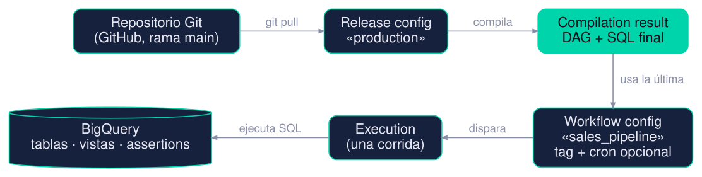
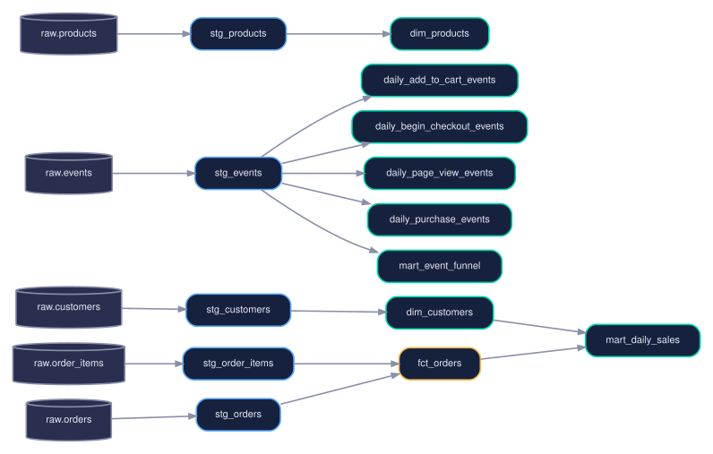

# Intro

::: {.notes}
⏱ 0:00–0:05 (después del warm-up de 10 min, que va fuera de las slides).
Objetivo de la intro: que la audiencia sienta el dolor ANTES de ver la herramienta.
:::

## ¿Qué veremos hoy?

| Bloque | Duración | Qué hacemos |
|---|---|---|
| **Parte 1** | 45 min | Qué es Dataform, qué mejora sobre SQL puro, pros y contras |
| ☕ Pausa | 5 min | Meme del día |
| **Parte 2** | 45 min | Demo en vivo en GCP: Terraform → datos → Dataform |
| Cierre | 10 min | Resumen y siguientes pasos |

::: {.fragment}
El repo de la demo: `github.com/rodo-nunez/dataform-demo` <span class="pill">se publica al final del stream</span>
:::

::: {.notes}
Bienvenida rápida. Menciona que todo el código es real: sale del repo que vamos a ejecutar en la segunda parte.
Recuerda publicar el repo (hoy está privado) antes de compartir el link.
Si quieres, pregunta al chat quién ya usa dbt o Dataform: sirve para calibrar el nivel.
:::

## El caso: el equipo de datos de una tienda online

Eres el/la data engineer de un e-commerce. Tienes en BigQuery:

`orders` · `order_items` · `customers` · `products` · `events`

::: {.incremental}
- Negocio pide **ventas diarias por canal y país** 📈
- Marketing pide el **embudo de conversión** por dispositivo 🛒
- Hoy: ~12 scripts `.sql` y una consulta programada que los llama "en orden"
:::

::: {.fragment}
> Es el mismo dataset que usaremos en la demo.
:::

::: {.notes}
Ancla empresarial: e-commerce/retail. Todo lo que muestre hoy sale de este caso.
Punto clave: hasta acá NADA de esto es un problema de SQL. Sabemos escribir los SELECT. El problema viene después.
:::

## El día que todo se rompe (3:00 a. m.)

::: {.incremental}
- 💥 El script `05` corrió antes que el `03` → el dashboard de ventas sale **en blanco**
- 🔁 Cambiaron el nombre de un dataset → hay que editar **30 archivos** a mano
- 🧾 Llegaron pedidos duplicados → el revenue quedó **inflado** y nadie lo notó hasta el lunes
- ❓ "¿De dónde sale esta columna?" → nadie lo sabe
:::

::: {.fragment}
El problema **no es el `SELECT`**. Es todo lo que rodea al `SELECT`.
:::

::: {.notes}
Cuenta esto como historia ("me pasó / le pasó a un cliente"). Cada bullet se corresponde con una feature que veremos:
1) orden y dependencias → ref() y DAG
2) nombres hardcodeados → ref() + config
3) datos malos → assertions
4) documentación y linaje → config con descripciones, grafo.
Esta slide es el hilo conductor de toda la Parte 1.
:::

# Parte 1 · Qué es Dataform

::: {.notes}
⏱ 0:05–0:15. Bloque A: definiciones y vocabulario. No te apures: el vocabulario es lo que más confunde al principio
(repositorio, release config, workflow config, compilación, ejecución).
:::

## Dataform en una frase

> Un framework para la **T** de ELT: tú escribes `SELECT`s; Dataform se encarga de **todo lo demás** (orden, materialización, tests, documentación, ejecución).

::: {.incremental}
- Servicio **serverless dentro de BigQuery** (Google Cloud): no hay servidores que mantener
- **No tiene costo propio**: pagas las consultas de BigQuery que ejecuta
- Tu proyecto es código: archivos `.sqlx` + JavaScript, en **Git**
- Núcleo y CLI **open source**; Google adquirió Dataform en 2020
:::

::: {.notes}
Si solo se acuerdan de una cosa: Dataform NO mueve datos (no es la E ni la L). Toma tablas que ya están en BigQuery y las transforma.
Sobre el costo: crear repositorios no cuesta; lo que cuesta son los jobs de BigQuery que se disparan al ejecutar (en la demo son centavos).
El núcleo open source (dataform-co/dataform en GitHub) es lo que compila tu código; el servicio de GCP es el que lo aloja, programa y ejecuta.
:::

## Dónde encaja en el stack

{width=100% fig-alt="Fuentes, ingesta, BigQuery raw, Dataform, BigQuery analytics, consumo"}

::: {.fragment}
Dataform **empieza donde termina la ingesta**: los datos ya están en `raw`.
:::

::: {.notes}
🖍️ **PIZARRA:** dibujar la cadena Fuentes → E+L → raw → T → analytics → BI y marcar con un círculo dónde vive Dataform.
ELT vs ETL: cargamos primero (raw) y transformamos DENTRO del warehouse. Por eso Dataform solo necesita generar SQL y dejar que BigQuery haga el trabajo pesado.
En nuestra demo la ingesta la hace un script Python que sube CSVs a `raw`.
:::

## Las piezas que hay que entender

{width=100% fig-alt="Repositorio, release config, compilation result, workflow config, execution, BigQuery"}

| Pieza | Qué es | En nuestra demo |
|---|---|---|
| **Repositorio** | Tu código, conectado a Git | `dataform-demo` ⇄ GitHub |
| **Release config** | Compila una rama y guarda el resultado | `production` (rama `main`) |
| **Workflow config** | Receta: qué acciones correr y cuándo | `sales_pipeline`, `events_pipeline` |
| **Execution** | Una corrida de esa receta | la que lanzamos a mano |

::: {.notes}
⏱ Dedícale tiempo: esta es la slide que más le va a servir a quien nunca usó Dataform.
Analogía: repositorio = receta escrita; release config = "imprimir la receta en limpio"; workflow config = "el menú del día, con horario"; execution = "cocinar".
Ojo con dos términos que se confunden: workspace (tu copia editable para desarrollar) y compilation result (el resultado inmutable de compilar un commit).
En la demo verás todo esto en la pestaña "Releases & scheduling".
:::

## ¿Qué hace el compilador de Dataform?

::: {.incremental}
1. Lee tus archivos `.sqlx` y JavaScript
2. Resuelve cada `ref()` y construye el **grafo de dependencias** (DAG)
3. Detecta errores **antes de ejecutar**: dependencias que no existen o circulares
4. Convierte JavaScript en SQL y agrega el "relleno": `CREATE TABLE`, `MERGE`…
5. Entrega **SQL puro + el orden de ejecución**
:::

::: {.fragment}
Compilar **no toca BigQuery** y es hermético: el mismo código produce siempre el mismo resultado.
:::

::: {.notes}
Esto explica por qué "compilar" es gratis y rápido, y por qué puedes correr `dataform compile` en tu laptop sin credenciales (lo hicimos en el repo).
La compilación corre en un sandbox sin acceso a internet: no puedes llamar APIs externas mientras compilas. Es una decisión de diseño para que sea reproducible.
Ejecutar es otra cosa: ahí sí se generan jobs en BigQuery y se paga.
:::

## Anatomía de un archivo `.sqlx`

::: {.fragment}
:::: {.columns}
::: {.column width="52%"}

```{.sql}
config {
  type: "view",
  schema: "staging",
  tags: ["sales"],
  description: "Cleaned customers",
  assertions: {
    uniqueKey: ["customer_id"],
    nonNull: ["customer_id", "email"]
  }
}
```

:::
::: {.column width="48%"}

**① Bloque `config`**  
Cómo se materializa (`view`), dónde vive (`schema`), cómo se agrupa (`tags`), qué documenta y **qué debe cumplirse** (`assertions`). Todo declarativo.

:::
::::
:::

::: {.fragment}
:::: {.columns}
::: {.column width="52%"}

```{.sql}
SELECT
  customer_id,
  LOWER(TRIM(email)) AS email,
  UPPER(TRIM(country)) AS country_code
FROM ${ref("raw", "customers")}
```

:::
::: {.column width="48%"}

**② Un `SELECT` normal**  
Lo que ya sabes. Sin `CREATE`, sin `INSERT`: Dataform lo agrega.

:::
::::
:::

::: {.fragment}
:::: {.columns}
::: {.column width="52%"}

```{.sql}
-- lo que escribes
FROM ${ref("raw", "customers")}

-- lo que Dataform compila
FROM `encoders-sandbox-rodo.raw.customers`
```

:::
::: {.column width="48%"}

**③ `${ref()}` → nombre real + dependencia**  
Una sola llamada: resuelve el nombre completo **y** le dice al grafo "esto depende de `raw.customers`".

:::
::::
:::

::: {.notes}
Archivo real del repo: definitions/staging/stg_customers.sqlx (simplificado para que quepa).
Idea a transmitir: un .sqlx = un bloque de configuración + un SELECT. Nada más. Si sabes SQL, ya sabes el 90%.
La expresión ${...} es JavaScript: se evalúa al compilar, no en BigQuery.
Si hay preguntas sobre el bloque config: existen muchas opciones más (type: operations, declaration, assertion…), hoy solo vemos las que usa la demo.
:::

# SQL puro: qué se rompe cuando crece

::: {.notes}
⏱ 0:15–0:20. Bloque B: ser justos con SQL puro. Funciona. El punto no es "SQL malo", es "SQL solo no escala".
:::

## SQL puro: al principio funciona

::: {.fragment}
:::: {.columns}
::: {.column width="56%"}

```{.sql}
CREATE OR REPLACE VIEW
  `encoders-sandbox-rodo.plain_sql.stg_customers` AS
SELECT
  customer_id,
  LOWER(TRIM(email)) AS email,
  UPPER(TRIM(country)) AS country_code
FROM `encoders-sandbox-rodo.raw.customers`;
```

:::
::: {.column width="44%"}

Un archivo por tabla. Nombres completos escritos a mano. Funciona a la primera. 👍

:::
::::
:::


::: {.fragment}
La **versión SQL puro** del pipeline completo está en `sql/` (12 archivos). Cada uno dice qué le falta con un comentario `-- LIMITATION:`.
:::

::: {.notes}
Aquí no hay truco: el SQL de SQL puro y el de Dataform es prácticamente idéntico. Lo dijimos en el repo: la lógica es la misma, y los resultados también (comprobamos que los marts salen iguales).
Lo que cambia es lo que hay ALREDEDOR. Siguiente slide.
:::

## Lo que SQL puro no te da

::: {.incremental}
- 🔗 **Dependencias**: el orden es el nombre del archivo (`01_`, `02_`…)
- ➕ **Incrementales**: `CREATE` + `MERGE` escritos a mano, columna por columna
- 🧪 **Tests de datos** que además **frenen** lo que viene después
- 📚 **Documentación y linaje**: quién depende de quién
- ♻️ **Reutilización**: copiar y pegar la misma consulta N veces
- 🌿 **Git, entornos y programación**: todo por fuera
:::

::: {.fragment}
Dataform mejora **cada uno** de estos seis puntos. Vamos uno por uno. 👇
:::

::: {.notes}
Esta slide es el índice de las siguientes 25 minutos. Menciona el orden: ref/DAG → config → assertions → incrementales → JavaScript → tags/workflows → Git y entornos.
:::

# Las features que mejoran el SQL

::: {.notes}
⏱ 0:20–0:45. Bloque C: el corazón de la Parte 1. Cada feature sigue el mismo patrón: cómo se ve en SQL puro → cómo se ve en Dataform → qué cambia.
Si vas corto de tiempo, prioriza: ref/DAG, assertions con bloqueo, incrementales. El resto puede ir más rápido.
:::

## ① `ref()`: dependencias sin pensar en el orden

::: {.fragment}
:::: {.columns}
::: {.column width="56%"}

```{.sql}
-- 05_dim_customers.sql  (SQL puro)
FROM `encoders-sandbox-rodo.plain_sql.stg_customers`
```

:::
::: {.column width="44%"}

Nombre **hardcodeado**. El orden lo da el nombre del archivo: si `05` corre antes que `01`, lees una vista vieja… o falla. Nada te avisa.

:::
::::
:::

::: {.fragment}
:::: {.columns}
::: {.column width="56%"}

```{.sql}
-- dim_customers.sqlx  (Dataform)
FROM ${ref("stg_customers")}
```

:::
::: {.column width="44%"}

- **Orden automático** (grafo)
- Nombre **resuelto** según proyecto/schema
- Cambiar un schema = un lugar

:::
::::
:::

::: {.fragment}
:::: {.columns}
::: {.column width="56%"}

```{.sql}
-- typo: "stg_customres"
Could not resolve "stg_customres"
```

:::
::: {.column width="44%"}

Un typo es un **error de compilación** (antes de ejecutar), no un incidente de producción a las 3 a. m.

:::
::::
:::

::: {.notes}
Mensaje real de error del compilador (lo reprodujimos): Could not resolve "stg_customres". También detecta dependencias circulares.
Ojo con una distinción: en SQL puro puedes ordenar con nombres de archivo o con un orquestador, pero la relación de dependencia vive en tu cabeza. En Dataform vive en el código.
:::

## El grafo que Dataform infirió solo

<div class="small"><span class="pill">raw</span> declaraciones · <span class="pill" style="color:#5aa9ff">staging</span> vistas · <span class="pill">analytics</span> tablas · <span class="pill amber">fct_orders</span> incremental</div>

{width=78% fig-alt="Grafo de dependencias del proyecto"}

::: {.notes}
🖍️ **PIZARRA:** redibujar a mano solo el tramo raw.orders → stg_orders → fct_orders → mart_daily_sales, y mostrar que nadie escribió estas flechas.
Este grafo sale de los ref() del proyecto real (14 tablas/vistas). No dibujamos nada.
Sin contar assertions: en la ejecución también aparecen 15 assertions (total 29 acciones).
En la consola de GCP vas a ver este mismo grafo, interactivo, en el workspace.
:::

## ② `config`: cómo se materializa cada tabla

::: {.fragment}
:::: {.columns}
::: {.column width="50%"}

```{.sql}
config {
  type: "table",   // "view" | "incremental"
  schema: "analytics",
  ...
}
```

:::
::: {.column width="50%"}

Cambiar de vista a tabla a incremental = **cambiar una palabra**. Dataform escribe el `CREATE` correspondiente.

:::
::::
:::

::: {.fragment}
:::: {.columns}
::: {.column width="50%"}

```{.sql}
bigquery: {
  partitionBy: "order_date",
  clusterBy: ["country_code", "channel"]
}
```

:::
::: {.column width="50%"}

Partición y clustering **declarativos**. En SQL puro: `PARTITION BY … CLUSTER BY …` dentro de cada `CREATE`, a mano.

:::
::::
:::

::: {.fragment}
:::: {.columns}
::: {.column width="50%"}

```{.sql}
description: "Daily sales of completed orders",
columns: {
  net_revenue: "Revenue after discounts.",
  avg_order_value: "Net revenue per order."
}
```

:::
::: {.column width="50%"}

La documentación **viaja con el código** y se publica como descripción en BigQuery.

:::
::::
:::

::: {.notes}
Archivo real: definitions/marts/mart_daily_sales.sqlx.
Mostrar después en la consola de BigQuery las descripciones de columnas de analytics.mart_daily_sales (aparecen solas).
Otras opciones del config que no mostramos hoy: labels, policy tags, hermetic, etc.
:::

## ③ Assertions: tests de datos incluidos

::: {.fragment}
:::: {.columns}
::: {.column width="52%"}

```{.sql}
assertions: {
  uniqueKey: ["order_id"],
  nonNull: ["order_id", "customer_id"],
  rowConditions: [
    "status IN ('pending','completed',
                'cancelled','returned')"
  ]
}
```

:::
::: {.column width="48%"}

**① Declaras la regla** en el `config` de la tabla. Tres tipos incluidos: unicidad, no nulos y condiciones por fila.

:::
::::
:::

::: {.fragment}
:::: {.columns}
::: {.column width="52%"}

```{.sql}
-- Dataform compila cada regla a una consulta
SELECT * FROM (
  SELECT order_id, COUNT(1) AS index_row_count
  FROM `…staging.stg_orders`
  GROUP BY order_id
) AS data
WHERE index_row_count > 1
```

:::
::: {.column width="48%"}

**② Una assertion es una consulta que busca filas malas.** Si devuelve filas → **falla**.

:::
::::
:::

::: {.fragment}
:::: {.columns}
::: {.column width="52%"}

```{.sql}
dataform_assertions.
  staging_stg_orders_assertions_uniqueKey_0
```

:::
::: {.column width="48%"}

**③ Cada resultado queda en una vista** de BigQuery: puedes ver *qué* filas fallaron.

:::
::::
:::

::: {.notes}
La consulta de la fila 2 es la real que compila Dataform (abreviamos el nombre del proyecto).
Recalca: una assertion NO es magia; es SQL que devuelve las filas que violan la regla. Por eso puedes escribir las tuyas (siguiente slide).
En el repo hay 15 assertions en total, casi todas generadas desde configs.
:::

## ③ Assertions a la medida (y dónde caen sus resultados)

::: {.columns}
::: {.column width="55%"}

```{.sql}
config { type: "assertion", tags: ["sales"] }

SELECT o.order_id, o.customer_id
FROM ${ref("stg_orders")} AS o
LEFT JOIN ${ref("stg_customers")} AS c
  ON o.customer_id = c.customer_id
WHERE c.customer_id IS NULL
```

:::
::: {.column width="45%"}

::: {.fragment}
**Regla de negocio propia**: "todo pedido pertenece a un cliente conocido".
:::

::: {.fragment}
Es un archivo `.sqlx` más: **entra al grafo** y corre **después** de las tablas que usa.
:::

::: {.fragment}
Las de `config` (`uniqueKey`, `nonNull`…) cubren lo común; las manuales, lo específico de tu negocio.
:::

:::
:::

::: {.notes}
Archivo real: definitions/assertions/assert_orders_have_customers.sqlx.
Con nuestro batch "bad" (orders con customer_id 999999) esta assertion devuelve 5 filas y falla; lo vamos a ver en la demo.
:::

## ③ …y lo mejor: pueden frenar lo que viene después

::: {.columns}
::: {.column width="46%"}

```{.sql}
config {
  type: "table",
  dependOnDependencyAssertions: true
}
```

:::
::: {.column width="54%"}

Si una assertion **de lo que consumes** falla, esta tabla **no corre**.

:::
:::

<span class="pill red">SQL puro</span>

<div class="flow"><span class="chip ok">stg ✔</span><span class="arrow">→</span><span class="chip ok">fct_orders ✔</span><span class="arrow">→</span><span class="chip ok">mart ✔</span><span class="arrow">→</span><span class="chip bad">checks ✖</span></div>

::: {.fragment}
El dato malo **ya llegó** al dashboard cuando el check se queja.
:::

::: {.fragment}
<span class="pill">Dataform</span>

<div class="flow"><span class="chip ok">stg ✔</span><span class="arrow">→</span><span class="chip bad">assertion ✖</span><span class="arrow">→</span><span class="chip skip">fct_orders ⏭</span><span class="arrow">→</span><span class="chip skip">mart ⏭</span></div>

El dato malo **no pasa**.
:::

::: {.notes}
⏱ Esta es probablemente la feature con mayor valor real. Tómate el tiempo.
En sql/12_checks.sql los checks corren al final: cuando fallan, fct_orders y mart_daily_sales ya tienen los datos malos. En Dataform, las acciones dependientes se saltan ("skipped").
En el compilador: fct_orders termina con 7 dependencias (2 tablas + 5 assertions). Lo verificamos en el JSON de compilación.
🖍️ **PIZARRA:** dibujar las dos cadenas de cajas y tachar el camino del dato malo en la segunda.
En la demo lo mostramos en vivo con `make load-bad`.
:::

## ④ Incrementales en SQL puro: a mano

::: {.columns}
::: {.column width="46%"}

::: {.fragment}
**① DDL a mano**, columna por columna

```{.sql}
CREATE TABLE IF NOT EXISTS
  `…plain_sql.fct_orders` (
  order_id INT64,
  customer_id INT64,
  order_ts TIMESTAMP,
  updated_at TIMESTAMP,
  status STRING,
  channel STRING,
  items_count INT64,
  units INT64,
  gross_revenue NUMERIC,
  discount_amount NUMERIC,
  net_revenue NUMERIC
)
PARTITION BY DATE(order_ts)
CLUSTER BY channel, status;
```
:::

:::
::: {.column width="54%"}

::: {.fragment}
**② `MERGE` a mano**, con `UPDATE SET` uno por uno

```{.sql}
MERGE `…plain_sql.fct_orders` AS target
USING (
  -- el SELECT (≈25 líneas) + el filtro:
  WHERE o.updated_at >
    (SELECT MAX(updated_at) FROM `…fct_orders`)
) AS source
ON target.order_id = source.order_id
WHEN MATCHED THEN UPDATE SET
  customer_id = source.customer_id,
  order_ts = source.order_ts,
  updated_at = source.updated_at,
  status = source.status,
  channel = source.channel,
  -- …5 columnas más, a mano…
  net_revenue = source.net_revenue
WHEN NOT MATCHED THEN INSERT ROW;
```
:::

::: {.fragment}
Agrega una columna al `SELECT` y debes cambiar **el DDL y el MERGE**. 😬
:::

:::
:::

::: {.notes}
Archivo real: sql/07_fct_orders.sql (≈60 líneas; aquí compactado).
Tres sitios que mantener sincronizados: DDL, SELECT y UPDATE SET. Olvidar uno = error en producción o, peor, una columna que no se actualiza en silencio.
"Full refresh" en SQL puro = DROP TABLE manual.
:::

## ④ Incrementales en Dataform: declarativos

::: {.fragment}
:::: {.columns}
::: {.column width="50%"}

```{.sql}
config {
  type: "incremental",
  schema: "analytics",
  uniqueKey: ["order_id"],
  bigquery: { partitionBy: "DATE(order_ts)" }
}
```

:::
::: {.column width="50%"}

**① Declaras la intención**: incremental, clave única, partición. Fin del DDL.

:::
::::
:::

::: {.fragment}
:::: {.columns}
::: {.column width="50%"}

```{.sql}
FROM ${ref("stg_orders")} AS o
LEFT JOIN order_totals AS t
  ON o.order_id = t.order_id
${when(incremental(),
  `WHERE o.updated_at >
     (SELECT MAX(updated_at) FROM ${self()})`)}
```

:::
::: {.column width="50%"}

**② Un solo `SELECT`.** `when(incremental(), …)` agrega el filtro **solo** en corridas incrementales. `${self()}` es la propia tabla.

:::
::::
:::

::: {.fragment}
:::: {.columns}
::: {.column width="50%"}

```{.sql}
-- 1ª corrida / full refresh
CREATE OR REPLACE TABLE …fct_orders
PARTITION BY DATE(order_ts) … AS (…);
-- corridas siguientes
MERGE …fct_orders T USING (…filtro…) S
ON T.order_id = S.order_id
WHEN MATCHED THEN UPDATE SET …
WHEN NOT MATCHED THEN INSERT …
```

:::
::: {.column width="50%"}

**③ Dataform genera el resto** (aproximación; el SQL exacto está en el log de cada ejecución).

:::
::::
:::

::: {.notes}
Archivo real: definitions/marts/fct_orders.sqlx.
Mismo resultado que las 60 líneas anteriores, sin DDL ni MERGE. La opción "full refresh" es un checkbox al ejecutar (la vimos en el diálogo de ejecución manual).
Advertencia honesta: el MERGE de ③ es una aproximación de lo que genera Dataform, no una copia literal. Muestra el real en la demo, en el log de la ejecución.
:::

## ④ Lo que pasa cuando llega el batch 2

| | Corrida #1 (batch 1) | Corrida #2 (batch 2) |
|---|---|---|
| Filas nuevas en `raw.orders` | 4 037 pedidos | 2 149 pedidos nuevos |
| Snapshots de pedidos **ya existentes** | – | 187 (127 `pending`→`completed`/`cancelled`, 60 `returned`) |
| Filas leídas en el filtro incremental | todas | solo `updated_at` > último visto |
| `fct_orders` después | 4 037 filas | **6 186 filas** (2 149 `INSERT` + 187 `UPDATE`) |

::: {.fragment}
Los cambios de estado **actualizan** filas existentes: por eso hace falta `MERGE`, no un simple `INSERT`.
:::

::: {.notes}
Valores esperados con el dataset sintético (semilla 42), validados en la emulación offline: 4 037 → 6 186 filas; 127 pedidos pending cambian de estado.
Cuando ejecutes la demo real, compara con estas cifras. Si difieren, es una pista de que algo no cargó bien.
🖍️ **PIZARRA:** dibujar la tabla fct_orders con 3 filas antes/después del MERGE mostrando una fila que cambia de pending a completed.
:::

## ⑤ JavaScript: reutilizar de verdad (includes)

::: {.fragment}
:::: {.columns}
::: {.column width="50%"}

```{.javascript}
// includes/constants.js
const FUNNEL_STEPS = [
  "page_view", "add_to_cart",
  "begin_checkout", "purchase"
];
module.exports = { FUNNEL_STEPS };
```

:::
::: {.column width="50%"}

**① Constantes compartidas.** Cada archivo de `includes/` queda disponible como objeto global con su nombre: `constants`.

:::
::::
:::

::: {.fragment}
:::: {.columns}
::: {.column width="50%"}

```{.javascript}
// includes/helpers.js
function sessionsByStep(steps) {
  return steps
    .map((step) =>
      `COUNT(DISTINCT IF(event_type = '${step}',
        session_id, NULL)) AS ${step}_sessions`)
    .join(",\n    ");
}
```

:::
::: {.column width="50%"}

**② Funciones que generan SQL.** Devuelve texto; Dataform lo inserta al compilar.

:::
::::
:::

::: {.notes}
Archivos reales: includes/constants.js y includes/helpers.js (helpers.js está simplificado con saltos de línea para que quepa).
En SQL puro esto no existe: la alternativa es Jinja externo, envsubst, o copiar/pegar.
JavaScript corre SOLO al compilar, no en BigQuery. Por eso es seguro: no puede llamar servicios externos.
:::

## ⑤ …y se usa dentro del `SELECT`

::: {.fragment}
:::: {.columns}
::: {.column width="68%"}

```{.sql}
WITH sessions AS (
  SELECT
    event_date,
    device,
    ${helpers.sessionsByStep(constants.FUNNEL_STEPS)}
  FROM ${ref("stg_events")}
  GROUP BY event_date, device
)
SELECT *,
  ${helpers.conversionRates(constants.FUNNEL_STEPS)}
FROM sessions
```

:::
::: {.column width="32%"}

**③ Una línea reemplaza cuatro columnas** (y tres tasas de conversión).

:::
::::
:::

::: {.fragment}
:::: {.columns}
::: {.column width="68%"}

```{.sql}
COUNT(DISTINCT IF(event_type='page_view',…)) AS page_view_sessions,
COUNT(DISTINCT IF(event_type='add_to_cart',…)) AS add_to_cart_sessions,
-- …2 columnas más…
SAFE_DIVIDE(add_to_cart_sessions, page_view_sessions)
  AS page_view_to_add_to_cart_rate, …
```

:::
::: {.column width="32%"}

**④ Compilado**: SQL plano. Agrega un paso a `FUNNEL_STEPS` y el SQL se actualiza solo.

:::
::::
:::

::: {.notes}
Archivo real: definitions/events/mart_event_funnel.sqlx. Salida compilada real (abreviada con …).
En sql/10_mart_event_funnel.sql las mismas columnas están copiadas a mano dos veces (sesiones y tasas).
:::

## ⑤ Generar tablas con un loop

::: {.fragment}
:::: {.columns}
::: {.column width="56%"}

```{.javascript}
constants.FUNNEL_STEPS.forEach((eventType) => {
  publish(`daily_${eventType}_events`, {
    type: "table",
    schema: "analytics",
    tags: ["events"],
  }).query((ctx) => `
    SELECT event_date, device, COUNT(*) AS events_count
    FROM ${ctx.ref("stg_events")}
    WHERE event_type = '${eventType}'
    GROUP BY event_date, device
  `);
});
```

:::
::: {.column width="44%"}

**Dataform**: 12 líneas → **4 tablas** (`daily_page_view_events`, …). Sumar un paso al funnel suma la tabla.

:::
::::
:::

::: {.fragment}
:::: {.columns}
::: {.column width="56%"}

```{.sql}
CREATE OR REPLACE TABLE `…daily_page_view_events` AS
SELECT event_date, device, COUNT(*) AS events_count
FROM `…stg_events` WHERE event_type = 'page_view'
GROUP BY event_date, device;
-- …y 3 copias más, cambiando una palabra
```

:::
::: {.column width="44%"}

**SQL puro**: la misma consulta **×4**. Arregla un bug en una copia y las otras tres siguen con el bug. 🐛

:::
::::
:::

::: {.notes}
Archivos reales: definitions/events/daily_event_tables.js vs sql/11_daily_event_tables.sql.
Caso empresarial: una tabla por país/cliente/tenant. Con un loop, agregar un país es agregar un elemento a una lista.
:::

## ⑥ Tags y workflow configs: ejecutar solo lo que necesitas

::: {.fragment}
:::: {.columns}
::: {.column width="52%"}

```{.sql}
-- en cada modelo
config { tags: ["sales"] }
```

:::
::: {.column width="48%"}

**① Etiquetas** en los modelos (`sales`, `events`).

:::
::::
:::

::: {.fragment}
:::: {.columns}
::: {.column width="52%"}

```{.bash}
resource "…workflow_config" "this" {
  for_each       = { sales_pipeline = "sales",
                     events_pipeline = "events" }
  release_config = ….release_config.production.id
  cron_schedule  = null      # manual; o "0 6 * * *"
  invocation_config { included_tags = [each.value] }
}
```

:::
::: {.column width="48%"}

**② Una receta por tag**, creada con Terraform: **dos procesos** independientes. Con `cron_schedule` se programan solos.

:::
::::
:::

::: {.notes}
Archivo real: terraform/dataform.tf (simplificado).
Aquí aparece un beneficio de "todo es código": el workflow configuration también es infraestructura versionada.
Nuestros dos procesos de la demo son exactamente estos: sales_pipeline y events_pipeline. Se pueden lanzar a mano o con cron.
Limitación honesta: el scheduling es básico. Si necesitas "cuando termine la ingesta X, corre Dataform", necesitas Cloud Composer / Workflows o llamar a la API.
:::

## ⑥ Operaciones: SQL arbitrario antes y después

::: {.fragment}
:::: {.columns}
::: {.column width="56%"}

```{.sql}
post_operations {
  ALTER TABLE ${self()}
  SET OPTIONS (labels = [("managed_by", "dataform")])
}
```

:::
::: {.column width="44%"}

`pre_operations` / `post_operations`: SQL extra que corre **antes o después** de construir la tabla. Etiquetas, permisos, avisos.

:::
::::
:::

::: {.fragment}
:::: {.columns}
::: {.column width="56%"}

```{.sql}
config { type: "operations", hasOutput: false }

-- cualquier SQL que no sea un SELECT
GRANT `roles/bigquery.dataViewer` …
```

:::
::: {.column width="44%"}

`type: "operations"`: una acción **propia** dentro del grafo (mantenimiento, grants, `DELETE`…), con dependencias como cualquier otra.

:::
::::
:::

::: {.notes}
La primera parte es real (definitions/marts/mart_daily_sales.sqlx). La segunda es solo ilustrativa: NO está en nuestro repo; sirve para mostrar el tipo "operations".
Regla práctica: si tu SQL no es un SELECT que crea una tabla, probablemente es una operation.
:::

## ⑦ Git, workspaces y entornos

<div class="flow"><span class="chip">workspace<br>(dev)</span><span class="arrow">→ commit / push →</span><span class="chip">Pull Request<br>(code review)</span><span class="arrow">→ merge →</span><span class="chip ok">main</span><span class="arrow">→ compila →</span><span class="chip ok">release config<br>production</span><span class="arrow">→</span><span class="chip ok">workflow<br>(prod)</span></div>

::: {.incremental}
- Cada dev trabaja en su **workspace** (copia editable del repo)
- Por defecto, una ejecución desde el workspace escribe en un **schema aparte** (`dataform_<workspace>`): no toca producción
- Producción corre desde un **release config** sobre `main`
- Cada cambio pasa por **Git**: historial, revisión, rollback
:::

::: {.notes}
Ojo con lo que vimos: nuestra service account solo tiene permisos sobre raw/staging/analytics/dataform_assertions. Por eso ejecutamos desde workflow configs y no desde workspaces (crearían el dataset dataform_<workspace>).
Buena práctica mencionada en la documentación: separar dev (workspace) y prod (release config).
En SQL puro todo esto es "una carpeta en Drive" o convenciones de equipo.
:::

## Resumen: lo que ganas sobre SQL puro

| Necesidad | SQL puro | Dataform |
|---|---|---|
| Orden de ejecución | nombre de archivo | **DAG automático** con `ref()` |
| Incrementales | `CREATE` + `MERGE` a mano | `type: "incremental"` + `uniqueKey` |
| Calidad de datos | `ASSERT` al final, sin bloqueo | **assertions** que frenan lo dependiente |
| Documentación | comentarios | `description` / `columns` → BigQuery |
| Reutilización | copiar y pegar | **JavaScript**: includes y loops |
| Ejecución selectiva | scripts sueltos | **tags** + workflow configs |
| Versionado y entornos | convenciones | **Git**, workspaces, release configs |

::: {.notes}
⏱ ~0:40. Recapitula tocando la tabla fila por fila. Es la slide para "capturar pantalla".
Mensaje clave: la ganancia NO es "menos líneas de SQL" (los SELECT son iguales); es correctitud, mantenibilidad y reproducibilidad.
:::

# Pros y contras (sin marketing)

::: {.notes}
⏱ 0:40–0:45. Ser honesto genera confianza. Varias de estas limitaciones vienen de reseñas y experiencias publicadas por equipos que compararon herramientas; son opiniones, no leyes.
:::

## Lo bueno ✅

::: {.incremental}
- 🧰 **Cero infraestructura**: servicio serverless dentro de BigQuery
- 💸 **Sin costo propio**: pagas solo las consultas de BigQuery
- 🔐 **Integración nativa** con IAM, BigQuery y Terraform
- 📈 **Curva suave** si ya sabes SQL: el 90 % del archivo es un `SELECT`
- ✅ **Lo importante viene incluido**: DAG, assertions, incrementales, documentación
- 🌿 **Git y CI/CD** (GitHub, GitLab, Azure DevOps, Bitbucket)
- 🔒 Compilación **hermética** y CLI open source
:::

::: {.notes}
Verificable en la documentación oficial: Dataform es serverless, se conecta a GitHub/GitLab/Azure DevOps/Bitbucket, y la compilación es hermética (mismo código → mismo resultado, sin internet).
:::

## Lo no tan bueno ⚠️

::: {.incremental}
- 🔒 **Solo BigQuery** en el servicio gestionado → dependencia de Google
- 👥 **Comunidad y ecosistema más chicos** que dbt (menos paquetes, ejemplos y integraciones)
- 🟨 **JavaScript en lugar de Jinja**: barrera para quien no lo usa
- 🧪 **Desarrollo local limitado**: compilas en tu laptop, pero ejecutar requiere BigQuery
- ⏱️ **Orquestación acotada** a tu proyecto: dependencias con otros sistemas → Composer / Workflows
- 📄 **Documentación y ejemplos más escasos**; el IDE web es sencillo
- 🧬 No hay "snapshots" (SCD tipo 2) listos como en dbt: se construyen a mano
:::

::: {.notes}
Fuentes de estas críticas (menciónalo como "según equipos que lo compararon"): reseña de Theodo sobre Dataform (menor madurez del desarrollo local y del ecosistema, documentación difícil de seguir), análisis de mercado sobre el foco en BigQuery, y experiencias en foros.
Sobre "snapshots": verifica antes del stream si sigue siendo cierto en la versión actual; no lo afirmes como absoluto.
No digas "Dataform está abandonado": hay opiniones de la comunidad en ambos sentidos y no las hemos verificado.
:::

## ¿Cuándo sí, cuándo no?

| ✅ Dataform es buena idea si… | ⚠️ Piénsalo dos veces si… |
|---|---|
| Tu warehouse es **BigQuery** (y lo será) | Tienes **más de un warehouse** (Snowflake, Databricks…) |
| Equipo **SQL-first**, chico o mediano | Necesitas un **ecosistema grande** de paquetes e integraciones |
| Quieres **cero infraestructura** | Tu equipo **ya usa dbt** y funciona bien |
| Ya vives en **GCP** (IAM, Terraform) | Gran parte de tu transformación es **Python/ML**, no SQL |

::: {.notes}
Recomendación concreta (como pide la guía de comparativas): si todo tu mundo es BigQuery y quieres simplicidad, Dataform gana por comodidad. Si hay multi-warehouse o dependes del ecosistema, dbt.
Y en cualquier caso: cualquiera de los dos es mejor que scripts sueltos.
:::

# Bonus: Dataform vs dbt {.center}

::: {.notes}
⏱ SOLO SI SOBRA TIEMPO (5 min). Si vas justo: presiona Esc (vista general) y salta directo a "Pausa memes".
Dato para orientar: ambas herramientas hacen lo mismo en esencia (SQL en archivos, ref(), tests, Git). Cambian el hogar, el lenguaje de plantillas y el ecosistema.
:::

## Mismo objetivo, distinta filosofía

| | **Dataform** | **dbt** |
|---|---|---|
| Dónde vive | Servicio dentro de BigQuery (GCP) | dbt Core (open source, CLI) + plataforma cloud de pago |
| Warehouses | BigQuery (servicio gestionado) | Muchos, vía adapters |
| Plantillas | SQLX + **JavaScript** | SQL + **Jinja** + macros |
| Tests | assertions (config + manuales) | tests genéricos en YAML, singulares y unit tests |
| Programación | **incluida** (workflow configs) | externa (Airflow/cron) o plataforma de pago |
| Documentación | en la consola de GCP | sitio generado con `dbt docs` |
| Ecosistema | más chico | muy grande (paquetes, integraciones) |
| Costo | sin costo propio | Core gratis; cloud de pago |

::: {.notes}
Puntos verificados en las comparativas consultadas: Dataform está centrado en BigQuery; dbt es portable entre warehouses; el ecosistema de dbt es mayor; Dataform incluye scheduling y Git en su plataforma.
Cuidado con afirmaciones absolutas: dbt también tiene opciones de programación (en su plataforma cloud) y Dataform tiene un core open source que se puede usar con CLI.
:::

## El mismo modelo en los dos mundos

::: {.columns}
::: {.column width="50%"}

<span class="pill">Dataform</span>

```{.sql}
config {
  type: "incremental",
  uniqueKey: ["order_id"],
  bigquery: {
    partitionBy: "DATE(order_ts)"
  }
}

SELECT … FROM ${ref("stg_orders")}
${when(incremental(),
  `WHERE updated_at > (
     SELECT MAX(updated_at) FROM ${self()})`)}
```

:::
::: {.column width="50%"}

::: {.fragment}
<span class="pill amber">dbt</span> <span class="tiny dim">(ilustrativo, no está en el repo)</span>

```{.sql}
{{ config(
    materialized='incremental',
    unique_key='order_id',
    partition_by={'field': 'order_ts',
                  'data_type': 'timestamp'}
) }}

SELECT … FROM {{ ref('stg_orders') }}

WHERE updated_at > (
  SELECT MAX(updated_at) FROM {{ this }})

```
:::

:::
:::

::: {.fragment}
Casi 1:1: `ref()`, `config`, incremental. Cambian la **plantilla** (`${ }` vs Jinja) y **dónde** definen los tests.
:::

::: {.notes}
El bloque dbt es una ilustración para comparar ideas, no un archivo del repo: no lo hemos ejecutado.
Mensaje: la lógica de negocio (los SELECT) es portable; lo que cambia es el envoltorio. Migrar entre ambas es trabajo real pero acotado.
:::

## ¿Cuál elijo?

::: {.columns}
::: {.column width="50%"}

<div class="card"><b>Dataform</b><br>BigQuery + GCP, equipo pequeño/mediano, quieres <b>simplicidad</b> y cero infraestructura.</div>

:::
::: {.column width="50%"}

<div class="card"><b>dbt</b><br>Multi-warehouse, quieres <b>ecosistema</b> y comunidad, o tu equipo ya lo domina.</div>

:::
:::

::: {.fragment}
> Ambos convierten **SQL suelto** en un proyecto con orden, tests y Git. Esa es la verdadera ganancia.
:::

::: {.notes}
Cierre del bonus. Invita al chat a contar qué usan y por qué.
:::

# ☕ Pausa · Meme del día {.center}

::: {.notes}
⏱ ~0:50. Cinco minutos de pausa. Deja la slide del meme en pantalla y comenta con el chat.
:::

## El meme {.center}

<div class="meme">
<div class="panel top"><div class="cap">Expectativa</div>Mis 40 scripts <code>.sql</code> corren <b>en orden</b> a las 3:00 a. m. ✨</div>
<div class="panel bottom"><div class="cap">Realidad</div><code>05_dim_customers.sql</code> corrió primero, el dashboard salió en blanco… y nadie se enteró hasta el lunes 🔥</div>
</div>

::: {.notes}
🖼️ **MEME:** formato "expectativa vs realidad" (dos paneles). Arriba, azul: los scripts corren en fila perfecta. Abajo, rojo: caos, dashboard en blanco. Si prefieres un meme conocido, busca "this is fine" (el perro en la habitación en llamas) con el pie: "los scripts SQL corriendo sin dependencias".
Chiste de la pausa: en SQL puro, el orden vive en la cabeza de alguien, en un README o en el nombre del archivo. Dataform lo convierte en un grafo que la máquina entiende.
Comentario gracioso para el chat: "¿cuál fue su peor incidente por orden de ejecución?".
:::

# Parte 2 · Demo en vivo

::: {.notes}
⏱ Segundos 45 min. Aquí se abre la terminal y la consola de GCP. El guion minutado está en docs/demo-runbook.md del repo.
:::

## Lo que vamos a hacer

::: {.incremental}
1. **Terraform**: `make tf-plan` → `make tf-apply` (repo, secreto, service account, datasets)
2. **Datos**: `make load-1` → `raw` en BigQuery
3. **Dataform**: correr `sales_pipeline` y `events_pipeline` desde la consola
4. **SQL puro**: `make sql-run` y comparar resultados
5. **Incremental**: `make load-2` → volver a correr → `MERGE`
6. **Datos malos**: `make load-bad` → assertions frenan el pipeline
7. **Teardown**: `make tf-destroy`
:::

::: {.notes}
Si terraform apply tarda demasiado en vivo, usa la infraestructura ya creada y muestra `terraform plan` + los archivos.
Recuerda el punto de ir a la pestaña "Releases & scheduling" para lanzar los workflows.
:::

## Qué mirar en cada paso

| Paso | Fíjate en… |
|---|---|
| Ejecución | el **grafo** y el **SQL compilado** de cada acción |
| Logs | tiempos, `bytes processed` y el `MERGE` real |
| BigQuery | descripciones de columnas, particiones, `dataform_assertions` |
| Batch 2 | `fct_orders`: 4 037 → 6 186 filas |
| Batch bad | acciones **skipped** y assertions en rojo |

::: {.notes}
Usa esta slide como guía mientras estás en la consola. Cada fila conecta con una feature de la Parte 1.
:::

# Cierre

::: {.notes}
⏱ Últimos 10 min del stream.
:::

## Lo que nos llevamos

::: {.incremental}
1. Dataform = **SQL + orden + tests + incrementales + documentación**, sin infraestructura
2. La ganancia real no es escribir menos SQL: es **correctitud y mantenibilidad**
3. Elige por **ecosistema**: solo BigQuery → Dataform; multi-warehouse → dbt
:::

::: {.notes}
Repite las tres ideas con tus palabras. Invita a mirar el repo y a probar la demo.
:::

## Para seguir estudiando

- Documentación de Dataform: [cloud.google.com/dataform/docs](https://cloud.google.com/dataform/docs)
- Assertions: [cloud.google.com/dataform/docs/assertions](https://cloud.google.com/dataform/docs/assertions)
- Núcleo open source: [github.com/dataform-co/dataform](https://github.com/dataform-co/dataform)
- Comparativa crítica: [theodo.com — Dataform](https://www.theodo.com/en-fr/blips/dataform)
- dbt: [docs.getdbt.com](https://docs.getdbt.com)
- **Repo del episodio**: `github.com/rodo-nunez/dataform-demo` (`README.md` + `docs/adr/`)

::: {.notes}
Recomienda empezar por el README del repo y el guion de la demo. Los ADR (docs/adr/) explican por qué se tomó cada decisión.
:::

## ¡Gracias! {.center}

{width=40%}

`@en_coders` · YouTube | Twitch

**Próxima clase:** por definir 🎯

::: {.notes}
Cierre y despedida. Invita a dejar preguntas en el chat.
:::

